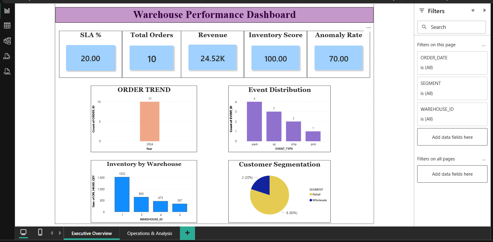
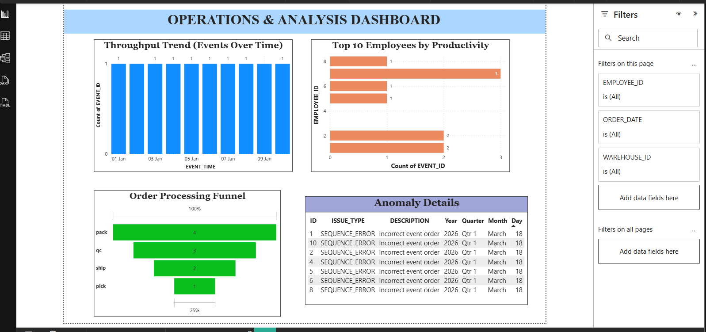

# 📦 Warehouse & Fulfillment Analytics Project

## 🚀 Overview

This project focuses on analyzing warehouse and fulfillment center operations using a modern data engineering architecture.
We built an end-to-end pipeline to process raw data, ensure data quality, detect anomalies, and visualize key performance indicators (KPIs).

---

## 🏗️ Architecture (Medallion Model)

We implemented a **3-layer architecture**:

### 🔹 Bronze Layer (Raw Data)

* Stores raw ingested data from external sources (AWS S3)
* No transformations applied
* Tables:

  * orders_raw
  * customers_raw
  * employees_raw
  * inventory_raw
  * events_raw

---

### 🔹 Silver Layer (Cleaned & Validated Data)

* Data validation and cleansing applied
* Referential integrity enforced using joins
* Duplicate removal and filtering of invalid records
* Exception handling for bad data

---

### 🔹 Gold Layer (Analytics Layer)

* Business-ready data model
* Star schema with:

  * Fact Tables: orders, events
  * Dimension Tables: customers, employees, inventory
* SCD Type 2 implemented for historical tracking
* Lifecycle table created for process analysis

---

## ⚙️ Data Pipeline

### 🔹 Data Ingestion

* Data loaded from AWS S3 using Snowflake stages
* CSV file format used

### 🔹 Incremental Processing

* Snowflake Streams used for change data capture
* Tasks used for automation (scheduled pipelines)

### 🔹 Transformation Flow

```text
S3 → Bronze → Silver → Gold
```

---

## 🔄 SCD Type 2 Implementation

* Maintains historical records of:

  * Customers
  * Employees
* Tracks:

  * Effective date
  * End date
  * Active status

---

## 🚨 Anomaly Detection

Automated procedures detect:

* SLA Breach (late shipments)
* Mis-pick (QC failures)
* Inventory mismatch
* Event sequence errors
* Productivity irregularities

All anomalies are stored in:

```text
GOLD.anomalies
```

---

## 📊 KPI Metrics

The following KPIs are calculated:

* SLA Compliance %
* Total Orders
* Revenue
* Inventory Utilization
* Employee Productivity
* Throughput Rate
* Anomaly Rate

---

## 📈 Power BI Dashboard

### 🔹 Page 1: Executive Overview

* KPI cards (SLA, Orders, Revenue, Inventory, Anomaly)
* Order trend
* Event distribution
* Customer segmentation
* Inventory insights

### 🔹 Page 2: Operations & Analysis

* Throughput trend
* Employee productivity
* Order processing funnel
* Detailed anomaly table

---

## 📸 Dashboard Screenshots

### 🔹 Executive Overview


### 🔹 Operations & Analysis


## 🔐 Data Governance

Implemented:

* Masking policies:

  * Email masking
  * Phone masking

* Row-level security:

  * Access restricted by state

---

## 🛠️ Tools & Technologies

* Snowflake (Data Warehouse)
* SQL (Transformations & Procedures)
* AWS S3 (Data Storage)
* Power BI (Visualization)
* GitHub (Version Control)

---

## 📂 Project Structure

```text
Warehouse_Project/
│
├── SQL/
│ └── Ecommerce-Warehouse.sql
│
├── Dashboards/
│ ├── WarehouseDashboard1.pbix
│ └── WarehouseDashboard2.pbix
│
├── Screenshots/
│ ├── Dashboard1.png
│ └── Dashboard2.png
│
├── Warehouse & Fulfillment Center Operations/
│ ├── customers_master.csv
│ ├── customers_inc.csv
│ ├── employees_master.csv
│ ├── employees_inc.csv
│ ├── inventory_master.csv
│ ├── inventory_inc.csv
│ ├── events_master.csv
│ ├── events_inc.csv
│ ├── orders_master.csv
│ └── orders_inc.csv
│
└── README.md
```

---

## ▶️ How to Run

1. Create database and schemas in Snowflake
2. Configure S3 stage and file format
3. Load data into Bronze tables
4. Run transformation scripts (Silver & Gold)
5. Execute:

```sql
CALL run_scd2();
CALL run_all_anomalies();
```

6. Connect Power BI to Snowflake
7. Build dashboard using Gold layer tables/views

---

## 👤 Author

SnowCoders Team

---

## 🌟 Key Highlights

✔ End-to-end data pipeline
✔ Real-time processing using Streams & Tasks
✔ SCD Type 2 implementation
✔ Automated anomaly detection
✔ Interactive Power BI dashboard
✔ Data governance and security

---

## 📌 Conclusion

This project demonstrates how modern data engineering practices can be applied to optimize warehouse operations, improve decision-making, and ensure data reliability.

---
